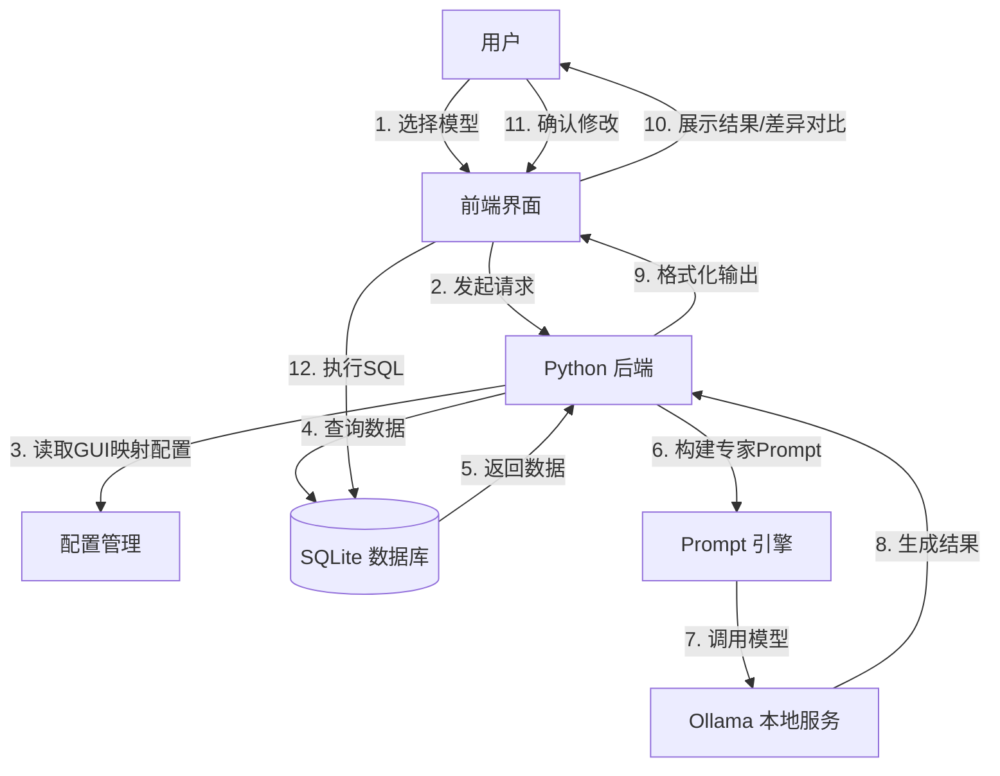

# DGSS Data Viewer + Ollama 集成工作流程

本工作流程描述如何将本地部署的 Ollama 大语言模型集成到 DGSS Data Viewer 中，实现智能化的地质数据交互、修改、生成和质检功能。

## 前置条件

1. **环境准备**

   - 安装 Ollama: 访问 https://ollama.com/ 下载并安装
   - 确保 Python 3.12 环境已配置完成
   - DGSS Data Viewer 应用已正常运行
2. **模型准备**

   ```bash
   # 默认模型
   ollama pull qwen3:8b
   ```
3. **服务启动**

   ```bash
   # 确保 Ollama 服务运行在默认端口 11434
   # Windows: Ollama 会作为后台服务自动启动
   # 可通过访问 http://localhost:11434 验证服务状态
   ```

## 工作流程

### 1. 模型选择功能 (Model Selection)

**目标**: 允许用户根据任务类型选择最合适的本地模型

#### 实现步骤

1. **后端API开发**

   - 在 `DGSS_Data_Viewer/backend/` 创建 `ollama_service.py`
   - 实现 `/api/ollama/models` 端点，调用 `ollama list` 获取可用模型列表
2. **前端UI实现**

   - 在主界面侧边栏添加 "AI 助手" 面板，设计参考google antigravity的布局设计，左侧是地质数据列表，中间是数据列，右侧是ai助手。
   - 创建模型选择下拉框，显示模型名称和大小
   - 添加模型状态指示器（在线/离线）
3. **配置保存**

   - 将用户选择的模型保存到应用配置文件
   - 支持为不同任务类型配置默认模型

---

### 2. 智能交互功能 (Natural Language Query)

**目标**: 用户通过自然语言查询数据库，获得专业的地质解释

#### 实现步骤

1. **上下文构建系统**

   在 `ollama_service.py` 中实现 `build_context()` 函数:

   ```python
   def build_context(db_path, table_name, user_query):
       # 1. 从GUI获取字段映射配置
       field_mappings = get_gui_field_mappings()

       # 2. 提取当前表的结构和样本数据
       schema = get_table_schema(db_path, table_name)
       sample_rows = get_sample_data(db_path, table_name, limit=5)

       # 3. 构建专家级 Prompt
       prompt = f"""
       [角色设定]
       你是一名资深地质专家，精通地质数据库分析。

       [数据字典]
       参考以下GUI配置的字段映射：
       {field_mappings}

       [当前数据上下文]
       表名: {table_name}
       结构: {schema}
       样本数据: {sample_rows}

       [用户问题]
       {user_query}

       请基于数据字典的含义解释回答用户问题。
       """
       return prompt
   ```
2. **Ollama调用接口**

   ```python
   import requests

   def query_ollama(model_name, prompt):
       url = "http://localhost:11434/api/generate"
       payload = {
           "model": model_name,
           "prompt": prompt,
           "stream": False
       }
       response = requests.post(url, json=payload)
       return response.json()["response"]
   ```
3. **前端集成**

   - 添加聊天式对话框UI
   - 实现流式输出显示（可选）
   - 添加历史对话记录

---

### 3. 批量修改功能 (Batch Modification)

**目标**: 智能化填充和批量优化数据库记录

#### 实现步骤

1. **场景触发机制**

   - 用户在表格中选中多行数据
   - 点击 "批量优化" 或 "AI 填充" 按钮
2. **数据提取与Prompt构建**

   ```python
   def build_modification_prompt(selected_rows, modification_request):
       prompt = f"""
       [任务]
       根据用户需求批量优化以下地质数据记录。

       [数据]
       {json.dumps(selected_rows, ensure_ascii=False)}

       [用户需求]
       {modification_request}

       [输出要求]
       仅返回JSON格式，结构如下:
       {{
           "modifications": [
               {{"row_id": 1, "field": "LITHO", "new_value": "花岗岩"}},
               ...
           ]
       }}
       """
       return prompt
   ```
3. **差异对比与确认**

   - 前端展示修改前后的对比表格
   - 高亮显示变更字段
   - 用户确认后执行批量 UPDATE 操作

---

### 4. 智能生成功能 (Data Generation)

**目标**: 基于点、线、面数据综合生成符合地质逻辑的新记录

#### 实现步骤

1. **多表数据关联**

   ```python
   def gather_geological_context(route_code):
       # 获取路线信息
       route_data = query_table("ROUTE", f"ROUTECODE='{route_code}'")

       # 获取关联的点数据
       points = query_table("GPOINT", f"ROUTECODE='{route_code}'")

       # 获取相关界线数据
       boundaries = query_table("BOUNDARY", "...")

       return {
           "route": route_data,
           "points": points,
           "boundaries": boundaries
       }
   ```
2. **专家级生成Prompt**

   ```python
   def build_generation_prompt(context, generation_request):
       prompt = f"""
       [角色]
       你是地质野外调查专家。

       [已知信息]
       路线: {context['route']}
       临近观测点: {context['points']}
       地质界线: {context['boundaries']}

       [生成需求]
       {generation_request}
       例如: "在该路线上生成一个新的观测点记录，坐标为(X, Y)"

       [输出要求]
       返回JSON格式的完整记录，必须包含所有必填字段。
       确保生成的数据符合地质逻辑和时空连续性。
       """
       return prompt
   ```
3. **结果验证与插入**

   - 验证生成的JSON格式和必填字段
   - 前端预览生成的记录
   - 用户确认后 INSERT 到数据库

---

### 5. 全局智能质检 (Quality Assurance)

**目标**: 扫描数据库，识别逻辑错误、格式问题和不合理的地质记录

#### 实现步骤

1. **质检触发**

   - 用户点击 "全库智能质检" 按钮
   - 选择要检查的表（或检查全部表）
2. **分批扫描策略**

   ```python
   def batch_quality_check(table_name, batch_size=100):
       total_rows = get_row_count(table_name)
       results = []

       for offset in range(0, total_rows, batch_size):
           batch_data = query_table(table_name, limit=batch_size, offset=offset)

           # 构建质检 Prompt
           prompt = f"""
           [任务]
           作为地质数据质检专家，分析以下数据批次的潜在问题。

           [检查项]
           1. 逻辑一致性:
              - 点号/路线号是否连续或异常重复？
              - 同一路线内的坐标是否合理分布？

           2. 数据完整性:
              - 关键字段（岩性、地层代号、坐标）是否缺失？
              - 必填字段是否有空值？

           3. 地质合理性:
              - 地层代号与岩性描述是否匹配？
              - 接触关系描述是否存在矛盾？
              - 坐标值是否在测区范围内？

           [数据批次]
           {json.dumps(batch_data, ensure_ascii=False)}

           [输出格式]
           返回JSON数组，每个问题包含:
           {{
               "row_id": <行ID>,
               "severity": "ERROR|WARNING|INFO",
               "category": "逻辑一致性|数据完整性|地质合理性",
               "description": "具体问题描述",
               "suggestion": "修改建议"
           }}
           """

           check_result = query_ollama(selected_model, prompt)
           results.extend(parse_json(check_result))

       return results
   ```
3. **质检报告生成**

   ```python
   def generate_qa_report(check_results):
       # 按严重程度分类
       errors = [r for r in check_results if r["severity"] == "ERROR"]
       warnings = [r for r in check_results if r["severity"] == "WARNING"]
       info = [r for r in check_results if r["severity"] == "INFO"]

       # 生成 Markdown 报告
       report = f"""
       # 地质数据质量诊断报告

       生成时间: {datetime.now()}

       ## 统计摘要
       - 🔴 严重错误: {len(errors)} 项
       - ⚠️ 警告: {len(warnings)} 项
       - ℹ️ 建议: {len(info)} 项

       ## 详细问题列表
       {format_issues(errors, warnings, info)}
       """

       save_report(report)
       return report
   ```
4. **前端交互**

   - 显示质检进度条
   - 问题列表支持筛选（按严重程度、类别）
   - 点击问题条目跳转到对应数据行
   - 支持批量修复或忽略问题

---

## 系统架构图



## 技术依赖

- **Python 包**

  ```bash
  pip install requests  # Ollama API 调用
  pip install flask     # 后端 API 服务
  ```
- **Ollama 安装验证**

  ```bash
  # 验证 Ollama 服务状态
  curl http://localhost:11434/api/tags
  ```

## 注意事项

1. **性能优化**

   - 对大批量数据质检采用分批处理策略
   - 实现请求缓存机制避免重复调用
   - 考虑使用异步处理提升响应速度
2. **安全性**

   - 所有数据库修改操作需用户确认
   - 实现操作日志记录
   - 支持撤销功能
3. **用户体验**

   - 提供模型响应时间预估
   - 实现流式输出提升交互感
   - 添加操作进度反馈

## 下一步

1. 实现基础的 Ollama 连接和模型选择功能
2. 开发智能交互模块并进行测试
3. 逐步添加修改、生成、质检功能
4. 收集用户反馈优化 Prompt 设计
